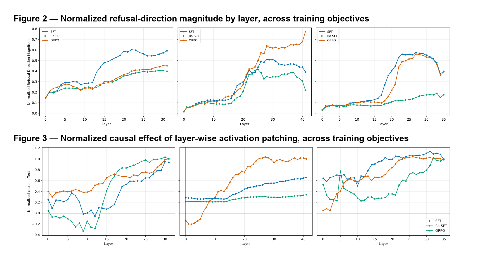

## **Beyond Shallow Alignment: How Post-Training Methods Determine Refusal Circuits and Steering Robustness**

Repository for the 2026 EMNLP Main Conference paper "Beyond Shallow Alignment: How Post-Training Methods Determine Refusal Circuits And Steering Robustness"


[Paper PDF](<_ARR_May__Martin__Beyond_Shallow_Alignment%20(3).pdf>) · [Reproduction guide](PIPELINE.md)· [](https://huggingface.co/collections/HoangCuongNguyen/emnlp-2026-post-training-analysis)

> **Warning:** this paper and repository discuss and evaluate harmful prompts for research purposes.

## Setup

Three post-training objectives are mapped onto a preference × reasoning grid,
holding base model, training data, and hyperparameters fixed so only the
objective varies:

|  | No reasoning | Reasoning |
|---|---|---|
| **No preference signal** | SFT | Ra-SFT |
| **Preference signal** | ORPO | — (future work) |

Each objective is applied to Llama-3.1-8B, Gemma-2-9B, and Qwen3-8B (six
fine-tuned checkpoints in total, plus the three base models), then analysed
with difference-in-means refusal-direction extraction, activation/attribution
patching, and two steering methods (ActAdd, ITI) — see the [reproduction
guide](PIPELINE.md) for how each stage of this repository implements that
pipeline.

## Key result: training objective reshapes refusal geometry and circuitry

Two patterns hold across all three architectures: post-training pushes each
objective's refusal direction away from both the base model and the other
two objectives, and Ra-SFT is consistently the outlier — SFT and ORPO stay
closer to each other than either does to Ra-SFT. This shows up both in *where
in the network* the refusal direction grows (Figure 2) and in *which layers
are causally responsible* for refusal (Figure 3): Ra-SFT distributes its
refusal-relevant computation gradually across layers, while SFT and ORPO
concentrate it in a mid-to-late-layer peak — a signature of reasoning-chain
supervision that is independent of architecture.



*Figure 2 (top): normalized refusal-direction magnitude per layer, per training
objective. Figure 3 (bottom): normalized causal effect of activation patching
per layer, per training objective. Both figures reproduced from the paper
(Sections 4.3–4.4).*

## The alignment trilemma

Across all six checkpoints, no offline post-training objective satisfies all
three properties a safely aligned model should have:

1. **Distributed refusal encoding** — refusal isn't concentrated in a
   handful of fragile components.
2. **Safety/utility separability** — steering toward safety doesn't
   degrade general capability (MMLU).
3. **Granular correctability** — safety behavior can be corrected via
   small, targeted interventions (steering).

Ra-SFT is the most correctable via steering but adds inference-time
deliberation overhead; ORPO gets the strongest attack-success-rate
reductions but produces the worst over-refusal (31.6% on XSTest for
Gemma-2-9B ORPO); Llama's safety and utility representations overlap enough
that ActAdd steering collapses MMLU accuracy at small steering strengths,
while Gemma's redundant, uniform refusal encoding defeats granular
correctability even though its safety and utility directions are orthogonal.

## Repository contents

This repository holds the full experimental pipeline behind the paper:
dataset preparation, fine-tuning scripts for all three post-training
objectives × three model families, refusal-direction extraction, causal
(activation/attribution) patching, ActAdd/ITI steering, and safety
benchmarking (StrongREJECT, WildJailbreak, XSTest, MMLU). See
[PIPELINE.md](PIPELINE.md) for the stage-by-stage guide to running it
end-to-end.

## Citation

If you found this repository useful, please consider citing both the paper and the code:

```bibtex
@inproceedings{hoang2026alignment,     
title = "{Beyond Shallow Alignment: How Post-Training Methods Determine Refusal Circuits and Steering Robustness",     
author = "Nguyen, Hoang Cuong and Dras, Mark and Naseem, Usman",     
booktitle = "Proceedings of the 2026 Conference on Empirical Methods in Natural Language Processing",     
series = {EMNLP~’2026},     
NOmonth = oct,     
year = "2026",     
address = "Budapest, Hungary",     
publisher = "Association for Computational Linguistics"
}
```

## Acknowledgements

This research was supported by the Macquarie University Data Horizons
Research Centre, the Australian Government through the Commonwealth-funded
Research Training Program (RTP) Stipend Scholarship, and the Macquarie
University Research Excellence Tuition Scholarship.
